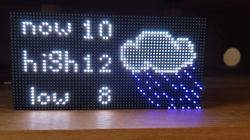

# LED Matrix Weather Display


Use a Raspberry Pi Zero W to display weather on a 64x32 LED display including temperature and weather conditions. 

Using the library [rpi-rgb-led-matrix](https://github.com/hzeller/rpi-rgb-led-matrix) to drive the display, and the pixel editor [piskel](https://github.com/piskelapp/piskel) to create the gifs. Big thanks to the creators of both projects.

# Description
Using the rpi-rgb-led-matrix library, we are able to display images on the LED display with the python bindings provided. Logically, there are two halves to this display, the left side is used for displaying the current temperature, and the right is used to display the current weather conditions as a gif.

## Getting the weather
This project uses the [weatherapi.com](https://www.weatherapi.com). This api was chosen because it was the first result when I ran a search for "weather api." The accuracy of this provider has been mediocre, so in the future it may be worth changing.

## Images
The temperature image is created using the python imaging library (PIL) to paste a set of template numbers into a dynamically generated 32x32 image. The templates can be found in the img/numbers directory or this project. 

The condition gif is chosen from a set of 6 gifs, sized 32x32 pixels, located in the img directory. weatherapi.com provides 60+ different conditions (which is copy+pasted into the file *weather_conditions.json* for easy access), and these 60+ conditions are mapped down to the 6 gifs in the file *get_weather.py*

Making the api request and building the images are done together in a thread to prevent interference with updatiing the display.

## Updating the display
The LED display can be very particular about clock delays. Running more processes than necessary in the display loop can cause flickering. To prevent this, the current temperature image and conditions gif are copied into one default file each. This means the display just has to reopen the file every time it wants to update, and doesn't have to worry about what to display, or what the contents are

There is an additional thread that runs to manage changing the brightness of the display based on the time of day. This is done in *time_of_day_brightness.py*.


# Build

## Materials
- Soldering equipment
- Raspberry Pi Zero W + sd card, other versions of the Pi will work.
- LED Matrix with Hub75 connector. I used [this one from AliExpress](https://www.aliexpress.com/item/32728985432.html) but similar models should work
- 5V 2.4A phone charger.
  
  
**WARNING!** When testing this project the maximum power drawn was under 5W, however displaying an entirely white screen at full brightness consumed over 15W, if you plan to use the display for other things, it is worth getting a beefier power supply.

## Steps
This build guide assumes knowledge of how to solder, basic python/unix navigation, as well as setting up a raspberry pi for headless operation.
- Solder the Hub75 connector to your pi as described in the rpi-rgb-led-matrix repository. [Link here](https://github.com/hzeller/rpi-rgb-led-matrix/blob/master/wiring.md).
- connect the 5V power supply to the matrix as well as the 5V pin on the raspberry pi
- Plug everything in and ssh into the Pi
- Clone the rpi-rgb-led-matrix repo and run the following commands in the project folder in order to install the python bindings. ([Commands taken from the python binding section of the library](https://github.com/hzeller/rpi-rgb-led-matrix/tree/master/bindings/python))
```
    sudo apt-get update && sudo apt-get install python3-dev python3-pillow -y
    make build-python PYTHON=$(command -v python3)
    sudo make install-python PYTHON=$(command -v python3)
```
- clone this repo and cd into it
- go to [weatherapi.com](https://www.weatherapi.com) and sign up for an account to get an api key
- update *get_weather.py* lines 8 and 9 with your api key and the city to look up when displaying the weather
- run `sudo python3 start.py` and watch the display begin

OPTIONAL:
in the file *time_of_day_brightness.py* you can change the brightness level of the display based on the hour of the day. You can use dictionary defined at the top of the file as a base and then add/remove/modify it as you wish. The basics are {hour of the day: brightness level}. Brightness levels of 1..100 are supported, and currently only on-the-hour is supported (e.g. 10, 14, 21, not 10.30).

Also celsius is currently the default temperature. This can be changed by setting the flag `use_celsius` in *get_weather.py* to `False`. Three digit numbers are not supported, so if you live in a hot place, there will probably be issues once you hit 100 degrees.

## TODO
- support negative temperatures
- support for a flag to run farenheit.
- support for 3 digit temperatures
- Better logging. Right now just uses print statements for simple debugging